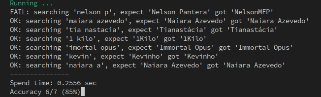

# elasticsearch-query-test

Simple tool to check the accuracy of elasticsearch query results.

## Instructions

`go get -u github.com/rodrigo-brito/elasticsearch-query-test`

```
Usage:
  elasticsearch-query-test [flags]

Flags:
  -e, --expectation string   expectation file eg. dir/custom_expect.csv (default "expectations.csv")
  -u, --url string           search base url eg. http://myhost.com/search (default "http://localhost")
```

* Fill the `expectations.csv` file with test cases

  * `search_term`: input search term
  * `result_field`: source field that the result will be compared
  * `result_value`: expected result value
  * `result_position`: expected position of the result
  * `description`: (optional) description of the expected result

## Output:


